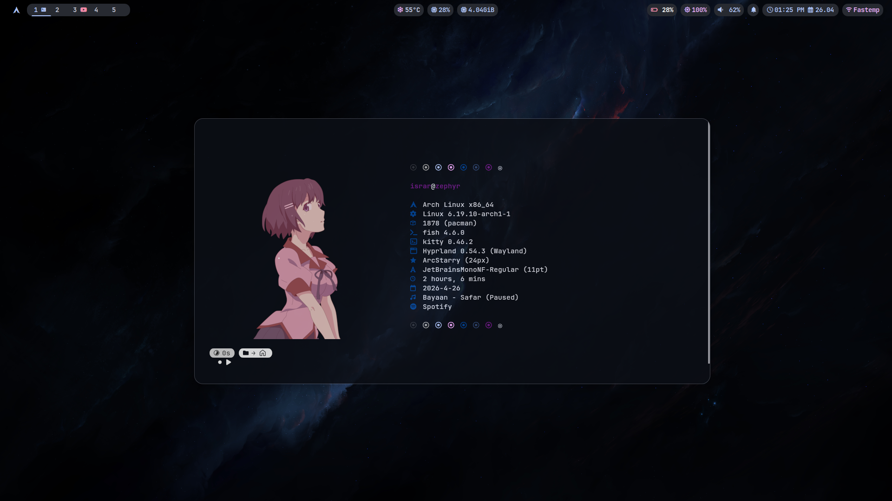

# Arch Hyprland Rice

> If this repo helps you, please **star it** and **follow me on GitHub**: [@israrkhan-cys](https://github.com/israrkhan-cys)

Personal dotfiles and desktop setup for **Arch Linux + Hyprland**.

## Preview



## Overview

This repo contains my personal Hyprland rice, including:

- `hypr` (Hyprland, hyprlock, hypridle)
- `waybar`
- `kitty`
- `yazi`
- `fastfetch`
- `starship`
-  `radiq`
- `.zshrc`

## Platform

- **OS:** Arch Linux  
- **Compositor:** Hyprland

## Directory layout

```text
.config/
  fastfetch/
  hypr/
  kitty/
  starship/
  waybar/
  yazi/
  radiq/
.zshrc
```

## Requirements

Install the tools used by this rice before copying configs:

- hyprland
- hyprlock
- hypridle
- waybar
- kitty
- radiq (App launcher)  
- yazi
- fastfetch
- starship
- zsh
- rofi (used by waybar wifi script)

## Radiq - App launcher
A Wayland-native, game-inspired radial application launcher designed for Hyprland.

link: [radiq](https://github.com/israrkhan-cys/radiq) 

You can also install radiq using AUR helper  `yay` and `paru`.
`yay -S radiq`

## Installation

1. Backup your current configs:
   ```bash
   mkdir -p ~/.config-backup
   cp -r ~/.config/hypr ~/.config/waybar ~/.config/kitty ~/.config/yazi ~/.config/fastfetch ~/.config/starship ~/.config-backup/ 2>/dev/null
   cp ~/.zshrc ~/.config-backup/.zshrc 2>/dev/null
   ```
2. Clone this repo:
   ```bash
   git clone https://github.com/israrkhan-cys/Arch-_hyprland_rice.git
   cd Arch-_hyprland_rice
   ```
3. Copy configs:
   ```bash
   cp -r .config/* ~/.config/
   cp .zshrc ~/
   ```
4. Reload your session:
   - Restart Hyprland (or log out/in)
   - Restart waybar
   - Reopen terminal

## Notes

This setup reflects my personal workflow, so feel free to fork and adjust it to your own taste.
